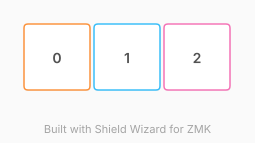

# ZMK Configuration for three parts

*Generated by Shield Wizard for ZMK*



Download compiled firmware from the Actions tab. <https://zmk.dev/docs/user-setup#installing-the-firmware>

Edit your keymap <https://zmk.dev/docs/keymaps>.
User keymap is located at [`config/three_parts.keymap`](config/three_parts.keymap).

-----

<details>
<summary>
Shield Wizard Debug Information
</summary>

In case of broken configuration, here is the Shield Wizard internal data used to generate this configuration:

Commit: 84a348b08cf4fec4a5441a46147e9a345b10ffab

```json
{"name":"three parts","shield":"three_parts","dongle":false,"modules":["petejohanson/cirque"],"layout":[{"id":"01M2TERVVAY6F9ZBNPFX1YDGC7","part":0,"row":0,"col":0,"w":1,"h":1,"x":0,"y":0,"r":0,"rx":0,"ry":0},{"id":"01M2TERW003KAQNMDJESRM01CS","part":1,"row":0,"col":1,"w":1,"h":1,"x":1,"y":0,"r":0,"rx":0,"ry":0},{"id":"01M2TERW4G0JS3WB4YG67BH83W","part":2,"row":0,"col":2,"w":1,"h":1,"x":2,"y":0,"r":0,"rx":0,"ry":0}],"parts":[{"name":"dongle","controller":"xiao_ble","pins":{"d0":{"usage":"bus","bus":"i2c0","role":"sda"},"d1":{"usage":"bus","bus":"i2c0","role":"scl"},"d10":{"usage":"kscan","kscan":"01M2TEZ466DT0Q98GHQRVKNPJN","role":"input"}},"kscans":[{"kind":"direct","id":"01M2TEZ466DT0Q98GHQRVKNPJN","mode":"gnd"}],"keys":{"01M2TERVVAY6F9ZBNPFX1YDGC7":{"input":"d10"}},"encoders":[],"buses":{"i2c0":{"type":"i2c","devices":[{"id":"01M2TETGVE742PKEVWDGAF1FHA","type":"ssd1306","add":60,"width":128,"height":64}]}}},{"name":"left","controller":"nice_nano_v2","pins":{"d0":{"usage":"bus","bus":"i2c0","role":"sda"},"d1":{"usage":"bus","bus":"i2c0","role":"scl"},"d21":{"usage":"kscan","kscan":"01M2TEZEEJQ345M5WWJFGZEA4G","role":"input"}},"kscans":[{"kind":"direct","id":"01M2TEZEEJQ345M5WWJFGZEA4G","mode":"gnd"}],"keys":{"01M2TERW003KAQNMDJESRM01CS":{"input":"d21"}},"encoders":[],"buses":{"i2c0":{"type":"i2c","devices":[{"id":"01M2TESWRMVYH2ZT1DX6AJKSQ9","type":"ssd1306","add":60,"width":128,"height":64}]}}},{"name":"right","controller":"nice_nano_v2","pins":{"d0":{"usage":"bus","bus":"i2c0","role":"sda"},"d1":{"usage":"bus","bus":"i2c0","role":"scl"},"d21":{"usage":"kscan","kscan":"01M2TEZHYCP5SDW5YT91VCTFMZ","role":"input"}},"kscans":[{"kind":"direct","id":"01M2TEZHYCP5SDW5YT91VCTFMZ","mode":"gnd"}],"keys":{"01M2TERW4G0JS3WB4YG67BH83W":{"input":"d21"}},"encoders":[],"buses":{"i2c0":{"type":"i2c","devices":[{"id":"01M2TESJZ7SXJKJ91K6WFA4DP6","type":"ssd1306","add":60,"width":128,"height":64}]}}}]}
```

</details>
